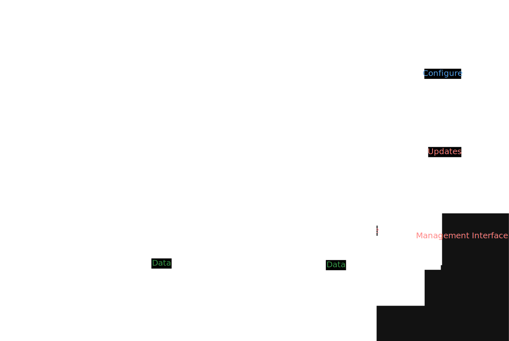
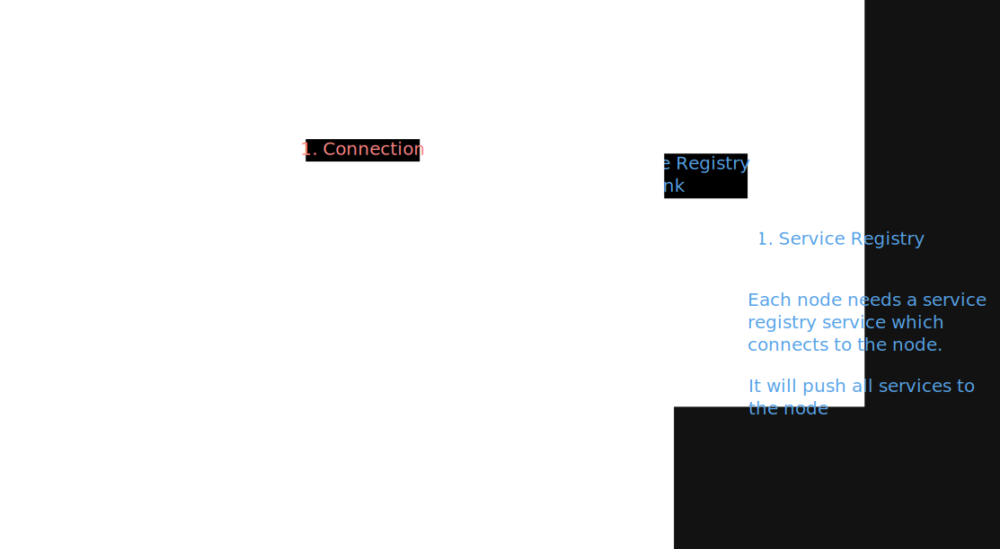

# Architecture overview for the Retiscope project

This document provides a general overview of the reticulum project. It includes images for ease of understanding.

## The Retiscope Node

A Retiscope Node is a special type of node that lives as a part of the reticulum network. Its primary purpose is to collect data about the structure of the network and to display it to the user in an easy to understand manner. The node itself is comprised of four key pillars: **The Frontend**, **The Database**, **The Configuration** and  **The Daemon**.

- The daemon is the primary interface and listener which listens to the reticulum network. It is configured using configured using special configuration files. The daemon should listen changes to these files and reload if necessary. It periodically sends relevant data to a database.

- The database contains all of the data collected by one or more daemons. Each database should be schemaful and only provide data in the correct format.

- The frontend is the primary user interface. It contains a node graph for network topography visualization. In the future it will also offer remote management capabilites.

- The configuration is a set of files which dictate the behaviour of both the frontend and the daemon. In the future the configuration may be changed using an inbuilt interface in the frontend.

The primary Retiscope node is depicted in white. The items with a green color represent both a regular reticulum node as well as an anchor node. The remaining area outlines how a possible remote management interface may look like.

## The Anchor Node

